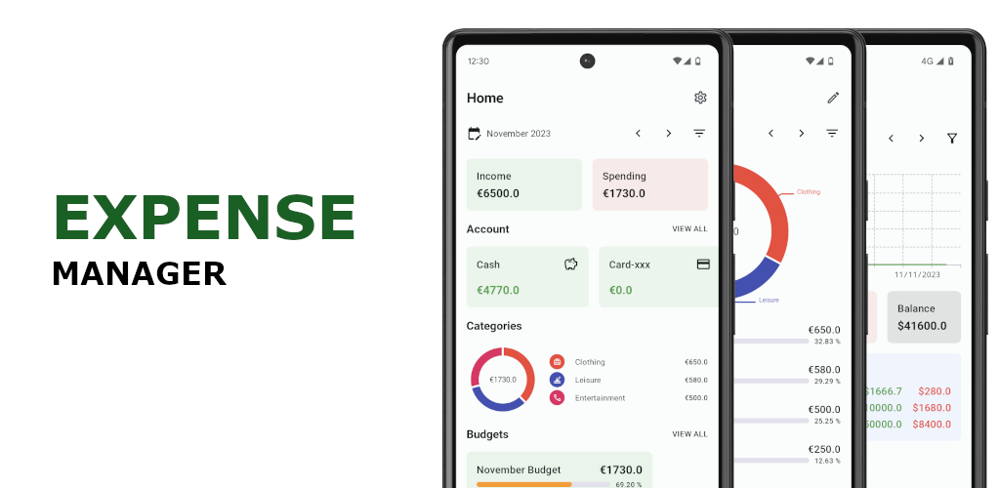
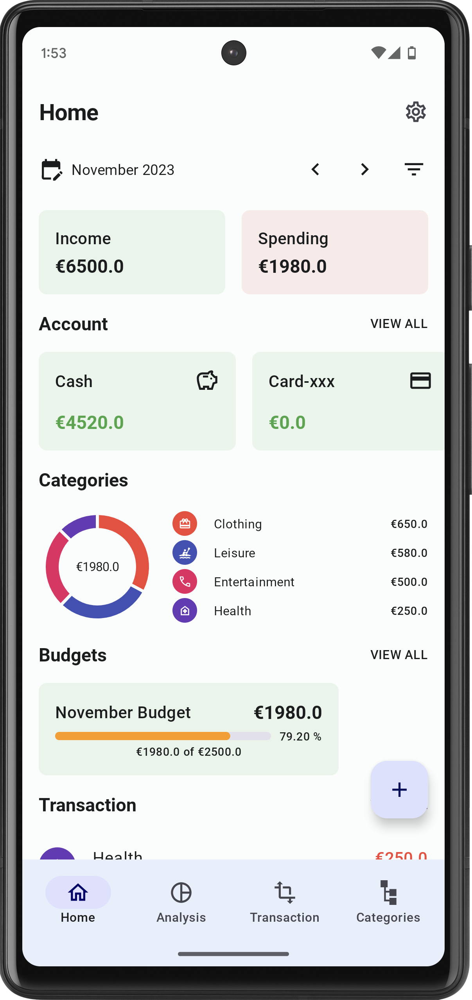
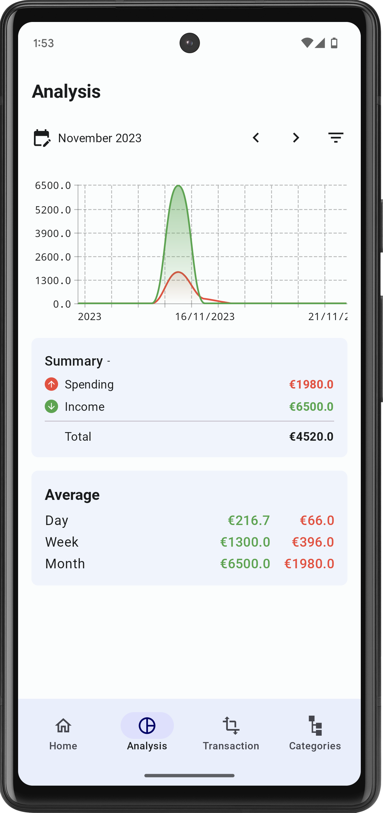
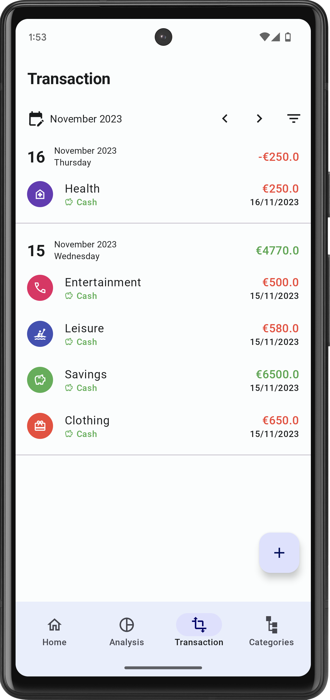
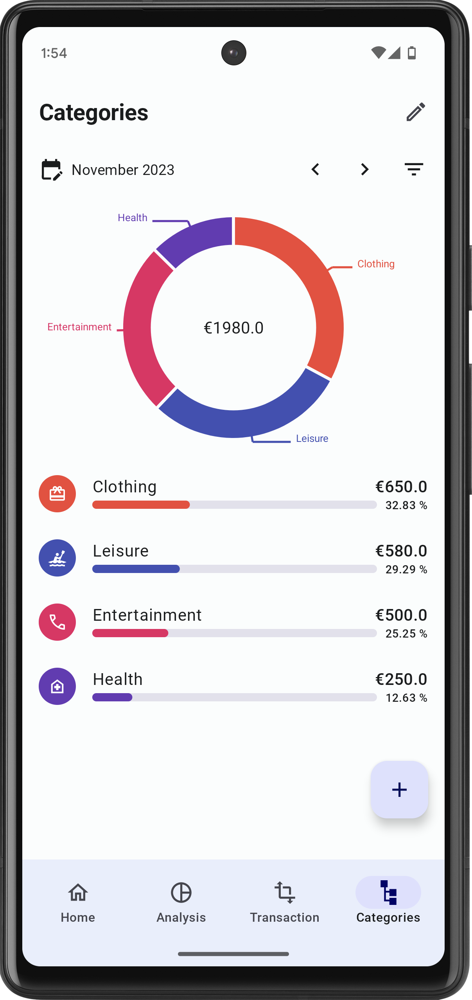
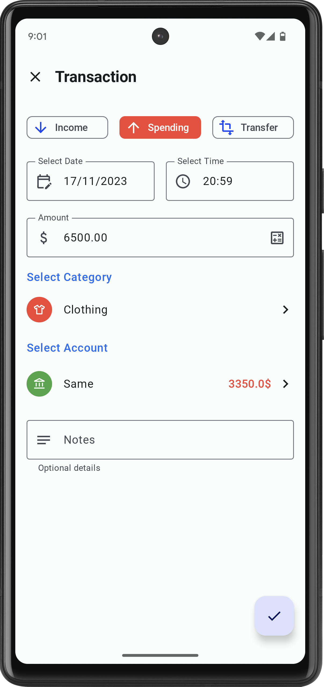
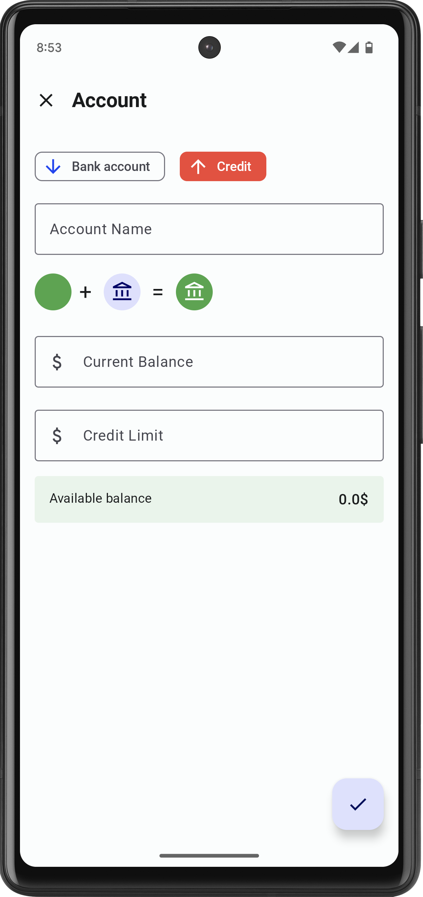
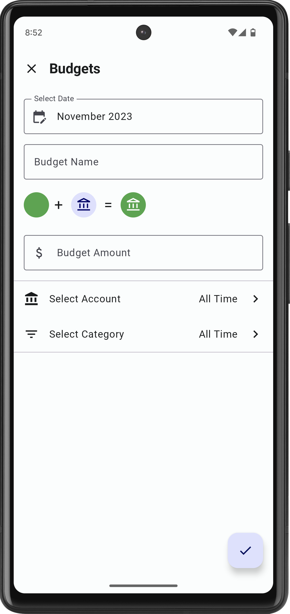
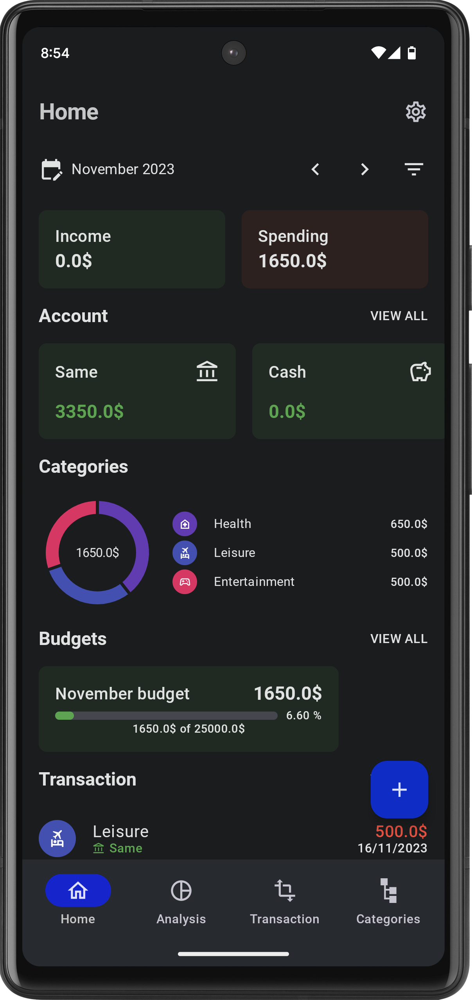

Personal & Business Level Expense Tracker App
==================
**Expense Manager** is a fully functional Android app built entirely with Kotlin and Jetpack
Compose. It follows Android design and development best practices and is intended to be a useful
reference for developers. As a running app, it's intended to help developers keep up-to-date with
the world of Android development by providing regular news updates.

**Features**

* Users can create multiple accounts to group their transactions under specific accounts
* Create monthly budgets and find extra budget customizing options
* Analyse and know the trends of your transactions on a day, week and monthly wise.
* Interactive category grouping pie chart to understand where you are mostly spending your money.
* Multiple currency switching in UI (Currency conversion is yet to be supported)
* Export your transactions into csv format (pdf will be added soon)

|                    Home Screen                    |                  Analysis Screen                  |                Transaction Screen                 |               Category Chart Screen               |
|:-------------------------------------------------:|:-------------------------------------------------:|:-------------------------------------------------:|:-------------------------------------------------:|
|  |  |  |  |

|                Transaction Create                 |                  Account Create                   |                   Budget Create                   |                    Dark Theme                     |
|:-------------------------------------------------:|:-------------------------------------------------:|:-------------------------------------------------:|:-------------------------------------------------:|
|  |  |  |  | 
